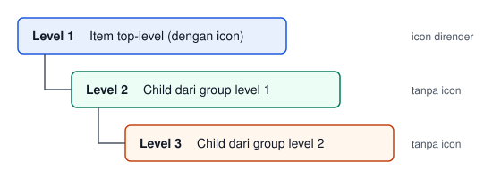
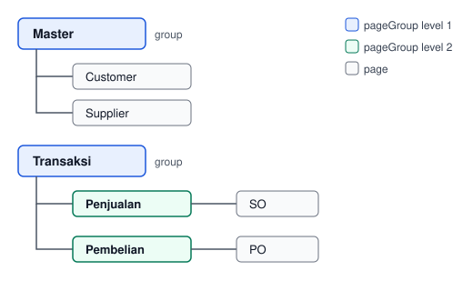

# Sidebar Navigation — `navigation`

> Konfigurasi manual sidebar navigation. Menimpa auto-derive dari `pageGroup` secara otomatis.

## Konsep

UDF mendukung dua mode pembentukan sidebar navigation:

| Mode | Trigger | Sumber |
|------|---------|--------|
| Auto-derive | Tidak ada blok `navigation` di root | `pageGroup` di setiap page |
| Manual | Ada blok `navigation` di root | Struktur eksplisit di `navigation.items[]` |

Jika kedua mekanisme ada (blok `navigation` ada DAN ada `pageGroup` di page), validator menghasilkan warning bahwa `pageGroup` akan diabaikan.

## Sintaks

```json
{
    "navigation": {
        "items": [
            {
                "type": "page",
                "pageRef": "dashboard",
                "icon": "home",
                "label": "Dashboard"
            },
            {
                "type": "group",
                "label": "Master Data",
                "icon": "data",
                "children": [
                    {"type": "page", "pageRef": "customer", "label": "Customer"},
                    {"type": "page", "pageRef": "supplier", "label": "Supplier"},
                    {"type": "page", "pageRef": "product", "label": "Product"}
                ]
            },
            {"type": "separator"},
            {
                "type": "link",
                "label": "Daily Review",
                "href": "attendance-review.html",
                "icon": "calendar",
                "permission": "ATTENDANCE_DAILY_READ"
            },
            {
                "type": "group",
                "label": "Transaksi",
                "icon": "document",
                "children": [
                    {
                        "type": "page",
                        "pageRef": "sales-order",
                        "label": "Sales Order",
                        "badgeColor": "warning"
                    }
                ]
            }
        ]
    }
}
```

## Properti `navigation`

| Properti | Tipe | Wajib | Keterangan |
|----------|------|:-----:|-----------|
| `items` | array | ✓ | Array item navigation (minimal 1 entry) |

## Properti `navigation.items[]`

Empat tipe item didukung: `page`, `link`, `group`, `separator`.

### Tipe `page`

Link langsung ke halaman.

```json
{
    "type": "page",
    "pageRef": "customer",
    "label": "Customer",
    "icon": "users",
    "badgeColor": "info"
}
```

| Properti | Tipe | Wajib | Keterangan |
|----------|------|:-----:|-----------|
| `type` | string | ✓ | Harus `"page"` |
| `pageRef` | string | ✓ | `pageId` yang dirujuk. Harus ada di `pages[]` |
| `label` | string | ✗ | Override label. Default: `pageTitle` dari page yang dirujuk |
| `icon` | string | ✗ | Override ikon. Hanya berlaku di depth 1 (top-level) |
| `badgeColor` | string | ✗ | Warna badge. Valid: `danger`, `info`, `primary`, `success`, `warning` |

### Tipe `link`

Link ke halaman custom yang ditulis manual dan tidak punya page UDF, misalnya halaman laporan atau halaman review.

```json
{
    "type": "link",
    "label": "Payroll Report",
    "href": "report-payroll.html",
    "permission": ["REPORT_PAYROLL_READ", "REPORT_ALL_READ"]
}
```

| Properti | Tipe | Wajib | Keterangan |
|----------|------|:-----:|-----------|
| `type` | string | ✓ | Harus `"link"` |
| `label` | string | ✓ | Label menu di sidebar |
| `href` | string | ✓ | File HTML tujuan, relatif terhadap folder aplikasi, misalnya `report-payroll.html` |
| `permission` | string \| array | ✗ | Kode permission untuk menampilkan menu. Bila berupa array, menu tampil selama pengguna memegang salah satu kode di dalamnya |
| `roles` | array | ✗ | Daftar role untuk menampilkan menu. Menu tampil selama pengguna memegang salah satu role di dalamnya. Lihat [Properti `roles` pada Item `link`](#properti-roles-pada-item-link) |
| `icon` | string | ✗ | Ikon menu. Hanya berlaku di depth 1 |
| `badgeColor` | string | ✗ | Warna badge. Valid: `danger`, `info`, `primary`, `success`, `warning` |

Item `link` boleh ditempatkan di tingkat mana pun, termasuk di dalam group. Menu ditandai aktif saat halaman `href` dibuka, dan group induknya ikut terbuka. Item `link` dengan `href` `index.html` atau `dashboard.html` menggantikan menu Home bawaan sidebar.

`permission` dan `roles` hanya dipakai pada aplikasi yang memakai blok `auth`. Tanpa blok `auth`, menu selalu tampil.

#### Properti `roles` pada Item `link`

`roles` membatasi menu berdasarkan role pengguna, misalnya untuk menu administrasi yang hanya boleh dilihat OWNER dan SUPER_ADMIN.

```json
{
    "type": "link",
    "label": "Users",
    "href": "rbac-users.html",
    "roles": ["OWNER", "SUPER_ADMIN"]
}
```

- Nilai berupa array string yang tidak kosong. Menu tampil bila pengguna memegang minimal satu role di array.
- Item `link` tanpa `roles` tidak dibatasi role.
- Group yang seluruh isinya tersembunyi ikut tersembunyi.
- Bila nilai berupa satu string, validator menampilkan peringatan dan string itu dipakai sebagai satu role. Nilai lain yang tidak valid, seperti array kosong, dibuang sehingga item tidak dibatasi role.
- Penyembunyian hanya mengatur tampilan. Hak akses tetap ditegakkan backend.

Key `roles` hanya berlaku pada item `link`. Grup Administration yang dibuat [`rbac --create`](../../commands/restforge-frontend/rbac.md) memakainya.

### Tipe `group`

Folder yang berisi sub-item.

```json
{
    "type": "group",
    "label": "Master Data",
    "icon": "data",
    "children": [
        {"type": "page", "pageRef": "customer"},
        {"type": "page", "pageRef": "supplier"}
    ]
}
```

| Properti | Tipe | Wajib | Keterangan |
|----------|------|:-----:|-----------|
| `type` | string | ✓ | Harus `"group"` |
| `label` | string | ✓ | Label folder di sidebar |
| `icon` | string | ✗ | Ikon folder. Hanya berlaku di depth 1 |
| `children` | array | ✓ | Array item child (minimal 1 entry, non-empty) |

### Tipe `separator`

Garis pemisah visual.

```json
{"type": "separator"}
```

Tidak memerlukan properti tambahan.

## Valid Type dan Color

| Field | Nilai Valid |
|-------|-------------|
| `type` | `group`, `link`, `page`, `separator` |
| `badgeColor` | `danger`, `info`, `primary`, `success`, `warning` |

Nilai di luar daftar valid menghasilkan error spesifik.

## Maksimal Kedalaman

Sidebar mendukung maksimal 3 level kedalaman (`NAV_MAX_DEPTH = 3`):



Lebih dari 3 level menghasilkan error:

```
<path> exceeds the maximum nesting depth of 3. Flatten the structure or remove the deepest group.
```

## Aturan Icon

Plugin `vanilla-js-auth` (berbasis Metronic) memakai icon font Keenicons. Nilai `icon` mendukung dua bentuk:

| Bentuk | Contoh | Hasil render |
|--------|--------|--------------|
| Nama icon (satu kata) | `"data"` | `<i class="ki-outline ki-data fs-2"></i>` |
| Kelas lengkap (mengandung spasi) | `"ki-solid ki-abstract-26 fs-2x"` | `<i class="ki-solid ki-abstract-26 fs-2x"></i>` (apa adanya) |

Bentuk kelas lengkap membebaskan pemilihan varian (`ki-outline`, `ki-solid`, `ki-duotone`) dan ukuran (`fs-2`, `fs-2x`, dst.) sesuai yang didukung Metronic. Jangan memakai kelas Tabler (`ti ti-*`) karena font Tabler tidak dimuat aplikasi hasil generate.

Atribut `icon` hanya dirender di depth 1 (top-level). Icon di depth lebih dalam menghasilkan warning:

```
<path>.icon is set at depth <n> but icons are only rendered at depth 1; this icon will be ignored.
```

## Aturan Validasi

| Aturan | Hasil |
|--------|-------|
| `navigation` harus object | Error: `"navigation must be an object, got <type>"` |
| `navigation.items` harus array | Error: `"navigation.items must be an array of navigation items"` |
| `type` valid | Error: `"<path>.type is invalid: '<value>'. Valid types: group, link, page, separator"` |
| `badgeColor` valid jika ada | Error: `"<path>.badgeColor is invalid: '<value>'. Valid colors: danger, info, primary, success, warning"` |
| `pageRef` wajib untuk type `page` | Error: `"<path>.pageRef must be provided when type='page'"` |
| `pageRef` harus ada di `pages[]` (scope `app`) | Error: `"<path>.pageRef '<value>' does not match any pageId in 'pages'. Add the page or fix the reference."` |
| `pageRef` orphan di scope `form` | Warning: `"<path>.pageRef '<value>' does not match any pageId in 'pages'. Sidebar will filter at runtime based on existing output files."` |
| `label` wajib untuk type `group` | Error: `"<path>.label must be provided when type='group'"` |
| `children` non-empty untuk type `group` | Error: `"<path>.children must be a non-empty array when type='group'"` |
| `label` wajib untuk type `link` | Error: `"<path>.label must be provided when type='link'"` |
| `href` wajib untuk type `link` | Error: `"<path>.href must be a non-empty string when type='link'"` |
| `roles` pada type `link` berupa array string yang tidak kosong | Warning: `"<path>.roles should be a non-empty array of non-empty strings, e.g. [\"ADMIN\"]"` |
| `permission` pada type `link` berupa string atau array string yang tidak kosong | Error: `"<path>.permission must be a non-empty string or a non-empty array of non-empty strings"` |
| Depth maks 3 | Error: `"<path> exceeds the maximum nesting depth of 3..."` |

## Menu dan Permission

Pada aplikasi yang memakai blok `auth`, sidebar menyembunyikan menu yang permission-nya tidak dimiliki pengguna:

| Item | Sumber permission |
|------|-------------------|
| `page` | `permissions.<pageRef>.read` di aggregator. Tanpa entri ini, menu selalu tampil |
| `link` | Properti `permission` item tersebut. Tanpa properti ini, menu selalu tampil |

Group yang semua isinya tersembunyi ikut disembunyikan, termasuk group yang hanya berisi sub-group kosong. Separator tidak dihitung sebagai isi group.

Untuk plugin `vanilla-js-auth`, `payload migrate` menulis entri `permissions.<pageRef>.read` secara otomatis dari RDF yang memakai `authGuard`, dengan nilai berformat `<RESOURCE>_READ`. Menu page tersebut dengan begitu hanya tampil untuk pengguna yang memegang permission READ resource-nya. Plugin lain tidak mendapat entri ini. Entri yang ditulis manual dipertahankan pada migrate ulang. Lihat [`payload migrate`](../../commands/restforge-backend/payload/migrate.md#permissions-untuk-plugin-vanilla-js-auth).

## Migrate Ulang

`navigation` yang disusun manual di aggregator dipertahankan saat `payload migrate` dijalankan ulang, termasuk group bersarang, separator, dan item `link`. Page yang `pageRef`-nya sudah ada di tingkat mana pun tidak ditambahkan lagi. Page baru masuk ke tingkat teratas `navigation`, lalu dapat dipindahkan ke group yang sesuai. Lihat [`payload migrate`](../../commands/restforge-backend/payload/migrate.md).

## Auto-Derive dari `pageGroup`

Jika tidak ada blok `navigation` di root, sidebar dibentuk secara otomatis dari `pageGroup` di setiap page:

```json
{
    "pages": [
        {"pageId": "customer", "pageGroup": ["Master"], "pageTitle": "Customer"},
        {"pageId": "supplier", "pageGroup": ["Master"], "pageTitle": "Supplier"},
        {"pageId": "sales-order", "pageGroup": ["Transaksi", "Penjualan"], "pageTitle": "SO"},
        {"pageId": "purchase-order", "pageGroup": ["Transaksi", "Pembelian"], "pageTitle": "PO"}
    ]
}
```

Hasil sidebar auto-derive:



Maksimal 2 level di `pageGroup` (page sendiri menempati level ke-3).

## Coexistence dengan `pageGroup`

Jika `navigation` ada DAN `pageGroup` juga didefinisikan di salah satu page, validator menghasilkan warning:

```
pageGroup is defined on the following pages but will be ignored because manual 'navigation'
block is present: <pageIds>. Remove the manual navigation block to use auto-derive,
or remove pageGroup to silence this warning.
```

Pilih salah satu mekanisme untuk menghindari kebingungan.

## Scope `app` vs `form` (Generate Mode)

Validasi `pageRef` berbeda antara scope `app` (generate semua page) dan `form` (generate satu page saja):

| Scope | Perilaku jika `pageRef` orphan |
|-------|-------------------------------|
| `app` | Error: page wajib ada di `pages[]` |
| `form` | Warning: sidebar akan difilter runtime berdasarkan file output yang ada |

Hal ini memungkinkan generate per-page tanpa harus regenerate sidebar setiap kali.

## Best Practice

| Skenario | Rekomendasi |
|----------|-------------|
| Aplikasi sederhana 1–5 page | Auto-derive cukup. Tulis `pageGroup` di setiap page |
| Aplikasi 10+ page dengan grup logis | Manual `navigation` untuk kontrol penuh urutan |
| Butuh separator antar grup | Manual `navigation` |
| Butuh badge berwarna di item tertentu | Manual `navigation` |
| Plugin auth dengan permission filtering | Manual `navigation` (plugin runtime filter berdasarkan permission) |
| Menu ke halaman custom tanpa page UDF | Item `link` di manual `navigation` |

---

← [`field-states.md`](./field-states.md) | [Selanjutnya: `homepage.md`](./homepage.md) →
