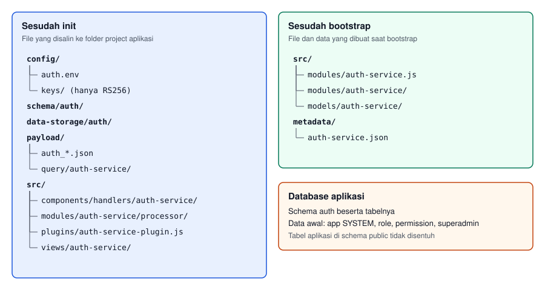

# `auth-service`

> Menyiapkan layanan auth berbasis RBAC (role dan permission) untuk aplikasi RESTForge, lengkap dengan editor RBAC di frontend.

`auth-service` memasang satu layanan auth terpisah ke folder project aplikasi. Layanan ini menerbitkan token login, menyimpan user, role, dan permission, lalu endpoint aplikasi memeriksa token tersebut lewat [`authGuard`](../../../catalogs/rdf/auth-guard.md). Lima perintah di resource ini menyiapkan layanan, menghubungkannya ke aplikasi, dan mendaftarkan permission aplikasi.

## Pattern

```
npx restforge auth-service <verb> [--flag=value]
```

## Daftar Perintah

| Verb | Tujuan | Halaman |
|------|--------|---------|
| `init` | Memasang file layanan auth ke folder project, tanpa menyentuh database | [`init.md`](./init.md) |
| `bootstrap` | Membuat schema, tabel, dan data awal di database, lalu membuat modul layanan auth | [`bootstrap.md`](./bootstrap.md) |
| `link` | Menghubungkan project aplikasi ke layanan auth dan memasang `authGuard` ke RDF | [`link.md`](./link.md) |
| `manifest` | Menyusun daftar permission dari RDF aplikasi | [`manifest.md`](./manifest.md) |
| `provision` | Mendaftarkan aplikasi, permission, role OWNER, dan user owner ke layanan auth | [`provision.md`](./provision.md) |

Editor RBAC di frontend dibuat oleh perintah designer [`rbac --create`](../../restforge-frontend/rbac.md).

## Kapan Dipakai

[`project auth`](../project/auth.md) cocok untuk aplikasi yang hanya membutuhkan login dan tidak membedakan hak akses per role. `auth-service` dipakai bila aplikasi membutuhkan role, permission per resource, dan editor untuk mengelolanya.

| Kebutuhan | Pilihan |
|-----------|---------|
| Login dan register, setiap pengguna pemilik tenant sendiri | `project auth` |
| Role, permission per resource dan aksi, serta editor RBAC | `auth-service` |

Satu project aplikasi memakai salah satu. `auth-service link` menolak project yang sudah memasang `project auth`.

## Prasyarat

- Database aplikasi berupa PostgreSQL. Dialect lain ditolak sebelum file apa pun ditulis.
- `@restforgejs/platform` terpasang lokal di folder project.
- File config database aplikasi (misalnya `config/db-connection.env`) sudah berisi koneksi dan `LICENSE`.
- Perintah yang tidak diberi `--config`, seperti `endpoint create` dan `payload migrate`, membaca config default. Jalankan [`config set-default`](../config/set-default.md) sekali per folder project.
- Layanan auth berjalan di port `3100` secara default. Bila port itu sudah dipakai proses lain, pilih port lain lewat `init --port` dan pakai port yang sama pada `--auth-api-url` di langkah `payload migrate`.

## Urutan Perintah Lengkap

Contoh berikut memakai project aplikasi `myapp` dengan app code `MYAPP`, dan satu resource bernama `item` yang sudah memiliki file `payload/item.json`. Langkah 4, 6, dan 9 diulang untuk setiap resource aplikasi.

### 1. Memasang layanan auth

```bat
cd /d D:\projects\myapp
npx restforge config set-default --config=config/db-connection.env
npx restforge auth-service init --app-config=db-connection.env
npm install
```

`init` menyalin file layanan auth dan membuat `config/auth.env`. Detail ada di [`init.md`](./init.md).

### 2. Membuat database layanan auth

```bat
cd /d D:\projects\myapp
npx restforge auth-service bootstrap
```

`bootstrap` menampilkan password `superadmin` dan `app_secret` aplikasi SYSTEM satu kali. Simpan keduanya saat itu juga. Detail ada di [`bootstrap.md`](./bootstrap.md).

### 3. Menjalankan layanan auth

```bat
cd /d D:\projects\myapp
npx restforge serve --project=auth-service --config=auth.env
```

Perintah ini berjalan terus, sehingga dijalankan di terminal tersendiri. Layanan auth harus aktif sebelum login dan sebelum editor RBAC dipakai.

### 4. Membuat endpoint aplikasi

```bat
cd /d D:\projects\myapp
npx restforge endpoint create --project=myapp --name=item --payload=item.json
```

`link` membaca daftar endpoint dari project, sehingga langkah ini harus lebih dulu. Tanpa endpoint, `link` berhenti dengan error dan tidak mengubah file apa pun.

### 5. Menghubungkan aplikasi ke layanan auth

```bat
cd /d D:\projects\myapp
npx restforge auth-service link --project=myapp --app-code=MYAPP
```

Detail ada di [`link.md`](./link.md).

### 6. Membuat ulang endpoint aplikasi

```bat
cd /d D:\projects\myapp
npx restforge endpoint create --project=myapp --name=item --payload=item.json --force
```

`authGuard` baru berlaku setelah endpoint dibuat ulang. `--force` menimpa file endpoint yang sudah ada tanpa konfirmasi.

### 7. Menyusun manifest permission

```bat
cd /d D:\projects\myapp
npx restforge auth-service manifest --project=myapp
```

Detail ada di [`manifest.md`](./manifest.md).

### 8. Mendaftarkan permission dan user owner

```bat
cd /d D:\projects\myapp
npx restforge auth-service provision --manifest=config/auth-manifest.json
```

`provision` menampilkan password owner satu kali bila passwordnya dibuat acak. Detail ada di [`provision.md`](./provision.md).

### 9. Membuat payload frontend

```bat
cd /d D:\projects\myapp
npx restforge payload migrate --name=item.json --project=myapp ^
  --output=frontend/payload --plugin=vanilla-js-auth ^
  --auth-app-code=MYAPP ^
  --auth-api-url=http://localhost:3100/api/auth-service
```

Plugin `vanilla-js-auth` wajib karena editor RBAC hanya berjalan di plugin ini. Untuk RDF yang memakai `authGuard`, `payload migrate` menulis entri `permissions.<pageRef>.read` ke file aplikasi UDF sehingga menu halaman mengikuti permission READ. Detail ada di [`payload migrate`](../payload/migrate.md#permissions-untuk-plugin-vanilla-js-auth).

### 10. Membuat editor RBAC

```bat
cd /d D:\projects\myapp
npx restforge-designer rbac --create --project=myapp
```

Detail ada di [`rbac.md`](../../restforge-frontend/rbac.md).

### 11. Membuat aplikasi frontend

```bat
cd /d D:\projects\myapp
npx restforge-designer generate --payload=./frontend/payload/myapp.json ^
  --output=./frontend/apps/myapp --overwrite
```

Alur auth-service berakhir di `generate`. [`auth --attach`](../../restforge-frontend/auth.md) tidak dipakai, dan `generate` tidak memperingatkan `js/rfx_auth.js` untuk aplikasi ini.

### Setelah Urutan Selesai

Jalankan aplikasi dengan `npx restforge serve --project=myapp --config=db-connection.env`, lalu buka halaman login frontend. User owner login dengan app code `MYAPP`, username hasil `provision` (misalnya `myapp-owner`), dan password yang ditampilkan `provision`.

## Struktur Folder



Seluruh file layanan auth berada di dalam folder project aplikasi. Layanan dan aplikasi memakai database yang sama, tetapi tabel layanan auth berada di schema `auth` sedangkan tabel aplikasi tetap di schema miliknya.

## Perintah Aplikasi yang Ikut Menyentuh Tabel Auth

Dua perintah yang dijalankan dari root project aplikasi membaca seluruh folder `schema/`, termasuk `schema/auth/`:

- `schema migrate --drop` membuang dan membuat ulang tabel layanan auth bersama tabel aplikasi, sehingga user, role, dan permission hilang.
- `data push --all-schemas` ikut memasukkan data awal layanan auth dari `data-storage/auth/`.

Untuk data aplikasi, push dengan `--schema=public` atau `--table=<NAME>`. Untuk membuat ulang tabel layanan auth, pakai [`bootstrap --reset`](./bootstrap.md#reset) yang hanya menyentuh schema `auth`.

```bat
cd /d D:\projects\myapp
npx restforge data push --schema=public --config=db-connection.env
```

---

**Lihat juga**: [`init`](./init.md) · [`bootstrap`](./bootstrap.md) · [`link`](./link.md) · [`manifest`](./manifest.md) · [`provision`](./provision.md) · [`rbac`](../../restforge-frontend/rbac.md) · [`commands/`](../../README.md) · [`README`](../../../README.md)
